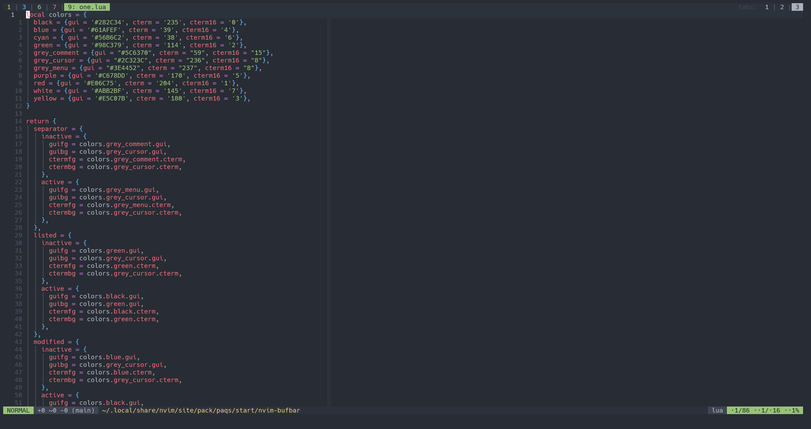

# nvim-bufbar

A simple and very light bufferline for Neovim written in Lua.

_**Note**: this plugin is mainly for my own use. I won't add new features/themes
if I don't need them. Feel free to submit PRs or fork the plugin though._



By default only the number of hidden buffers are displayed, see
[configuration](#configuration) to show their name instead.

The plugin highlights buffers in different colors based on their type. With the
default colorscheme, modified buffers are blue, unmodified ones are green and
terminal buffers are red. Counters for each buffer type are shown in the top
right corner.

## Installation

#### With Packer:
```lua
use {'ojroques/nvim-bufbar'}
```

#### With Plug
```vim
Plug 'ojroques/nvim-bufbar'
```

## Usage
In your *init.lua*:
```lua
require('bufbar').setup {}
```

If you're using a *.vimrc* or *init.vim*:
```vim
lua require('bufbar').setup {}
```

## Configuration
You can pass options to the `setup()` function. Here are all available options
with their default settings:
```lua
M.options = {
  theme = 'default',         -- the theme in 'lua/bufbar/themes' to use
  counters = true,           -- show buffer type counters ([L]isted, [M]odified, [T]erminal)
  show_bufname = 'current',  -- show full buffer name ('current', 'visible' or 'all')
  show_flags = true,         -- show buffer flags
  show_alternate = false,    -- show alternate buffer
  modifier = ':t',           -- the buffer name modifier
  separator = '|',           -- the buffer separator
}
```

## License
[LICENSE](./LICENSE)
